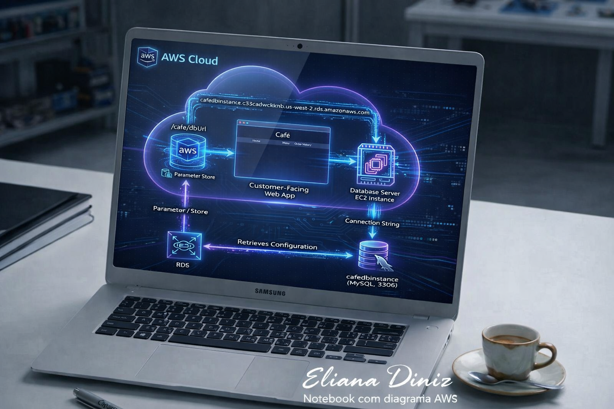

  

☕ Cloud Database Migration & Architecture: Café Web App & Amazon RDS
Projeto prático de arquitetura em nuvem e engenharia de dados realizado na AWS, migrando a persistência de uma aplicação web de cafeteria para um banco de dados relacional gerenciado e altamente escalável.

🚀 Sobre o Desafio
Quem olha para uma simples página de pedidos de uma cafeteria nem imagina o que rola nos bastidores da engenharia de software. O objetivo deste laboratório foi resolver um clássico problema de infraestrutura: tirar um sistema web de pedidos ("Café") de uma instância isolada e conectá-lo de forma segura, escalável e resiliente a um banco de dados gerenciado em nuvem.

🛠️ Arquitetura e Etapas Executadas
O projeto foi estruturado e validado através das seguintes etapas técnicas:

🔍 Diagnóstico e Configuração do Ambiente:

Análise da arquitetura de rede e mapeamento inicial dos parâmetros de conexão da aplicação.

🗄️ Implementação do Amazon RDS:

Configuração de um banco de dados relacional robusto na AWS (cafedbinstance), garantindo segurança, isolamento e alta disponibilidade.

⚙️ Centralização de Configurações no Systems Manager (Parameter Store):

Atualização dinâmica do parâmetro de endpoint do banco (/cafe/dbUrl) para apontar diretamente para a nova instância RDS, desacoplando o código da infraestrutura física.

🧪 Validação End-to-End:

Conexão via terminal na instância EC2 (CafeInstance), execução de consultas SQL nativas (SELECT * FROM product;) e validação de persistência na interface web (Order History).

📈 Monitoramento em Tempo Real:

Acompanhamento de métricas de performance e conexões ativas (DatabaseConnections) integradas ao Amazon CloudWatch diretamente pelo console do RDS.

📊 Arquitetura da Solução

+-------------------------------------------------------+
       |                        AWS Cloud                      |
       |                                                       |
       |   +--------------------+     /cafe/dbUrl              |
       |   |  Parameter Store   |--------------------+         |
       |   +--------------------+                    |         |
       |                                             v         |
       |   +--------------------+         +--------------------+ |
       |   | Customer-Facing    |-------->| Database Server    | |
       |   | Web App (Cafe)     |         | EC2 Instance       | |
       |   +--------------------+         +--------------------+ |
       |                                             |         |
       |                                             v         |
       |                                  +--------------------+ |
       |                                  | Amazon RDS         | |
       |                                  | (cafedbinstance)   | |
       |                                  +--------------------+ |
       +-------------------------------------------------------+

       🎯 Resultado Final
Sistema 100% Integrado: Aplicação web rodando sem interrupções e comunicando-se perfeitamente com o banco de dados gerenciado.

Dados Seguros na Nuvem: Persistência garantida com auditoria e monitoramento de performance ativos.

💻 Tecnologias Utilizadas
Amazon EC2 (Servidor de Aplicação Web)

Amazon RDS (Banco de Dados Relacional MySQL)

AWS Systems Manager - Parameter Store (Gerenciamento centralizado de configurações)

Amazon CloudWatch (Monitoramento de métricas e performance)

SQL / MySQL Terminal (Validação e consultas de dados
